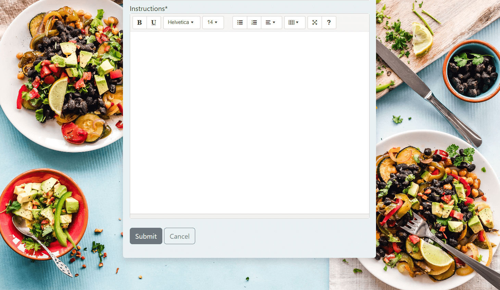

# Everything but the Gluten

Everything but the gluten is a recipe sharing website helping people find and share gluten free recipes. The aim of the site is to help people living with coeliac disease on their life long gluten free journey.
Users are able to sign up to create their own personal account where they can post recipes, comment on recipes and save their favourite recipes.

View the live site here [Everything but the Gluten](https://everything-but-the-gluten.herokuapp.com/)

# User Experience (UX)
- The user experience (UX) and user interface (UI) was considered from the start of the design process. The site aims to give the user an enjoyable experience whilst easily and intuitively navigating and interacting with the site on mobile, tablet, laptop or desktop devices.

## Wireframes

[Balsamiq](https://balsamiq.com/wireframes/) was used to create the wireframes for mobile, tablet and desktop versions of the site. See the screen shots here - [Wireframes](wireframe.md)

# Features

## The Nav Bar
- There are different variations of the navbar feature depending on three possible users. 
    - A first time vistor or a user that has not signed into the site - Visitor navbar
    - A site member who has signed in - Members navbar
    - an admin user who has signed in - Admin navbar

## Visitor navbar

- The visitor navbar is displayed when the site first loads. It contains navigation links to the Home page, Recipes page, About page, Login page and Register page. The sites name Everything but the Gluten is also displayed to the left and is used as a link to the homepage.

## Member navbar

- The Member navbar is displayed when a user has successfully signed into the site. 
- A custom drop down menu feature greets the user displaying their username. 
- Within the users custom drop down menu are links to:
    - Add a Recipe - allows the user to submit a recipe
    - My Published Recipes - displays all recipes the user has submiited and have been approved.
    - My Favourite Recipes - displays all recipes the user has saved a s a favourite
    - My Pending Recipes - displays all recipes the user has submitted which are still waiting on approval.
    - Change Password - allows the user to change their password.
    - Sign out - allows the user to sign out.

- Each of the dropdown links also contain an icon to give an added visual indication to the user to assist them in navigating the site.

## Admin navbar

- The Admin navbar is displayed when an admin has successfully signed into the site. 
- A custom drop down menu feature greets the admin displaying their username. 
- Within the admin custom drop down menu are links to:
    - Recipes Waiting - displays all recipes awaiting admin approval. 
    - Add a Recipe - allows the user to submit a recipe
    - My Published Recipes - displays all recipes the user has submiited and have been approved.
    - My Favourite Recipes - displays all recipes the user has saved a s a favourite
    - My Pending Recipes - displays all recipes the user has submitted which are still waiting on approval.
    - Change Password - allows the user to change their password.
    - Sign out - allows the user to sign out.

- Each of the dropdown links also contain an icon to give an added visual indication to the user to assist them in navigating the site.

- The navbar is fully responsive for mobile and tablet devices.

### The landing page

 

- The landing page contains a background image of a grandmother and granddaughter in a kitchen. The main colours of the image are white and light grey, this colour tone is continued through the site and provides a subtle and neutral feel to the site. The image is also very eye catching to anyone with coeliac disease (the main target audience). The image conveys the message that even though they are baking which is a high risk to coeliacs unless strict adherance to gluten free ingredients is followed the grandmother and granddaughter are also conveying the message of trust.

- A welcome messsage is displayed to the user with a descrption of the sites features.
- A call to action button leads the user to the Recipes section.
- The landing page is fully responsive for mobile and tablet devices.

 

### The footer

 

A subtle footer contains social media icon links in the same color style as the rest of the site. The icon color changes to silver when hovered on.

### The Recipes page

 

- The recipes page displays all recipes that have been submitted and approved.
- The recipes are displayed on bootstrap styled cards with a shadow effect added to highlight each of them.
- All vistors to the site can view the displayed recipes.
- All vistors to the site can click on a recipe to bring them to the recipe details page.
- The recipe page uses pagination to display 6 recipes at a time.

### The Pagination Menu

 

- The pagination menu sits below the displayed recipes. It provides an easy to use navigation systme to the user.
- A first page and last page button allow easy and quick navigation to the first or last page.
- A next page and previous page arrow icon allows the user to quickly browse forward or back through pages of recipes.
- The current page being displayed is also highlighted to the user.
- This pagination menu gives the user an enjoyable and natural user experience.

### Add Recipe

 
 

- The Add Recipe feature uses a form to allow registered memebers to submit recipes.
- A Summernote editor has been add to the ingredients and instructions fields.

### Input Validation

 

- Input validation has been applied allowing only alphanumeric characters in the title, only numbers in the preparation and cooking time fields.
- All fields are required to be filled.
- Feedback messages are displayed to the user if any field is not filled out correctly.

### Success Message

 

- When a recipe has been successfully submitted a message is displayed indicating that the recipe is now awaiting approval.

### Pending Recipes Page

 

- My Pending Recipe Page displays the registered members recipes that have been submitted and are awaiting approval.
- After a user has successfully submitted a recipe they are redirected to their Pending Recipes page where they can see a list of any recipes they have submitted that are awaiting approval.

### Published Recipes Page

 

- My Published Recipe Page displays the registered members recipes that have been approved and are now published on the site.

## Favourite Recipes Page

 

- My Favourite Recipe page displays all the recipes that the user has marked as a favourite recipe.