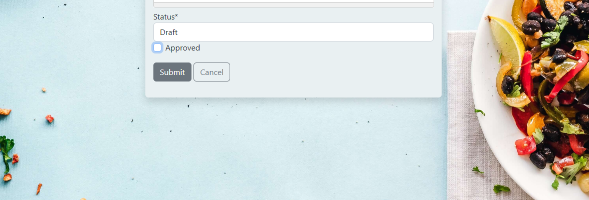

# Everything but the Gluten

Everything but the gluten is a recipe sharing website helping people find and share gluten free recipes. The aim of the site is to help people living with coeliac disease on their life long gluten free journey.
Users are able to sign up to create their own personal account where they can post recipes, comment on recipes and save their favourite recipes.

View the live site here [Everything but the Gluten](https://everything-but-the-gluten.herokuapp.com/)

# User Experience (UX)
- The user experience (UX) and user interface (UI) was considered from the start of the design process. The site aims to give the user an enjoyable experience whilst easily and intuitively navigating and interacting with the site on mobile, tablet, laptop or desktop devices.

## Wireframes

[Balsamiq](https://balsamiq.com/wireframes/) was used to create the wireframes for mobile, tablet and desktop versions of the site. See the screen shots here - [Wireframes](wireframe.md)

# Features

## The Nav Bar
- There are different variations of the navbar feature depending on three possible users. 
    - A first time vistor or a user that has not signed into the site - Visitor navbar
    - A site member who has signed in - Members navbar
    - an admin user who has signed in - Admin navbar

## Visitor navbar

- The visitor navbar is displayed when the site first loads. It contains navigation links to the Home page, Recipes page, About page, Login page and Register page. The sites name Everything but the Gluten is also displayed to the left and is used as a link to the homepage.

## Member navbar

- The Member navbar is displayed when a user has successfully signed into the site. 
- A custom drop down menu feature greets the user displaying their username. 
- Within the users custom drop down menu are links to:
    - Add a Recipe - allows the user to submit a recipe
    - My Published Recipes - displays all recipes the user has submiited and have been approved.
    - My Favourite Recipes - displays all recipes the user has saved a s a favourite
    - My Pending Recipes - displays all recipes the user has submitted which are still waiting on approval.
    - Change Password - allows the user to change their password.
    - Sign out - allows the user to sign out.

- Each of the dropdown links also contain an icon to give an added visual indication to the user to assist them in navigating the site.

## Admin navbar

- The Admin navbar is displayed when an admin has successfully signed into the site. 
- A custom drop down menu feature greets the admin displaying their username. 
- Within the admin custom drop down menu are links to:
    - Recipes Waiting - displays all recipes awaiting admin approval. 
    - Add a Recipe - allows the user to submit a recipe
    - My Published Recipes - displays all recipes the user has submiited and have been approved.
    - My Favourite Recipes - displays all recipes the user has saved a s a favourite
    - My Pending Recipes - displays all recipes the user has submitted which are still waiting on approval.
    - Change Password - allows the user to change their password.
    - Sign out - allows the user to sign out.

- Each of the dropdown links also contain an icon to give an added visual indication to the user to assist them in navigating the site.

- The navbar is fully responsive for mobile and tablet devices.

## The landing page

 

- The landing page contains a background image of a grandmother and granddaughter in a kitchen. The main colours of the image are white and light grey, this colour tone is continued through the site and provides a subtle and neutral feel to the site. The image is also very eye catching to anyone with coeliac disease (the main target audience). The image conveys the message that even though they are baking which is a high risk to coeliacs unless strict adherance to gluten free ingredients is followed the grandmother and granddaughter are also conveying the message of trust.

- A welcome messsage is displayed to the user with a descrption of the sites features.
- A call to action button leads the user to the Recipes section.
- The landing page is fully responsive for mobile and tablet devices.

 

## The footer

 

A subtle footer contains social media icon links in the same color style as the rest of the site. The icon color changes to silver when hovered on.

## The Recipes page

 

- The recipes page displays all recipes that have been submitted and approved.
- The recipes are displayed on bootstrap styled cards with a shadow effect added to highlight each of them.
- All vistors to the site can view the displayed recipes.
- All vistors to the site can click on a recipe to bring them to the recipe details page.
- The recipe page uses pagination to display 6 recipes at a time.

## The Pagination Menu

 

- The pagination menu sits below the displayed recipes. It provides an easy to use navigation systme to the user.
- A first page and last page button allow easy and quick navigation to the first or last page.
- A next page and previous page arrow icon allows the user to quickly browse forward or back through pages of recipes.
- The current page being displayed is also highlighted to the user.
- This pagination menu gives the user an enjoyable and natural user experience.

## Add Recipe

 
 

- The Add Recipe feature uses a form to allow registered members to submit recipes.
- A Summernote editor has been add to the ingredients and instructions fields.
- An image file can be uploaded with the recipe, if a file is not uploaded by the user then a default placeholder image will be used.

## Input Validation

 

- Input validation has been applied allowing only alphanumeric characters in the title, only numbers in the preparation and cooking time fields.
- All fields are required to be filled.
- Feedback messages are displayed to the user if any field is not filled out correctly.

## Success Message

 

- When a recipe has been successfully submitted a success message is displayed indicating that the recipe is now awaiting approval.
- Recipes are reviewed by administrator to ensure they only contain gluten free ingredients.

## Pending Recipes Page

 

- My Pending Recipe Page displays the registered members recipes that have been submitted and are awaiting approval.
- After a user has successfully submitted a recipe they are redirected to their Pending Recipes page where they can see a list of any recipes they have submitted that are awaiting approval.

## Published Recipes Page

 

- My Published Recipe Page displays the registered members recipes that have been approved and are now published on the site.

## Favourite Recipes Page

 

- My Favourite Recipe page displays all the recipes that the user has marked as a favourite recipe.

## Recipe Details Page

 
- The Recipe Details page gives the full details of a recipe.
- The top of the page dislays the recipe title and author.
- If the user is the author of the recipe they are given the option of anEdit button anda Delet button. This is only displayed if the user is the author of the recipe.
- The option to Add to Favourites is also displayed allowing the user to save a recipe as a favourite by clicking on the heart outline icon. 

 
- When the user has added the recipe to their favourites the icon and text change to reflect this.
- A chat icon is also displayed and indicates the number of comments the recipe has received.

 

 
- The recipe details contain an image, a list of Ingredients and a list of Instruction steps.

## comments

 
- The Comments area is at the end of the recipe details page.
- The Comments area is only available to registered members.
- Only members can leave comments on recipes.
- Members comments are posted without the need for admin approval as it was felt this gives are more engaging experience to the user interacting with the site.

## Edit Recipe

 
 
- The edit recipe feature is availble to edit a recipe.
- A member can edit any recipe of which they are the author by selecting the Edit Button on the recipe detail page.
- A recipe form with the poulated details of the recipe is displayed which allows the author to edit the recipe. 
- When a recipe is updated it is submitted for review by an admin user before being approved. This is to ensure all recipes on the site only contain gluten free ingredients.

 
-  A message is displayed to user when they submit an update or edit to a recipe.

## Delete Recipe

 
- A member can delete their own recipe by selecting the Delete Button on the recipe details page.
- A message box displays a confirmation option to the user with the recipe title in it.

## Admin User - Recipes Waiting 

 

 

- The admin user has access to a Recipes Waiting page that allow them to see any recipes that are awaiting approval.

## Admin User - Recipe Approval

- The admin user can then select a recipe thats awaitng approval, review it and then set the recipe at the bottom of the recipe form to Published & Approved.
- Once approved the recipes will be published on the site for all users to see.

## Change Password

- The Change Password page allows a member to change their own password by filling out the password form

## Sign out

- The Sign out page displays when the user selects to sign out from the navigation menu. 
- A message box displays a confirm sign out or cancel sign out button to the user.