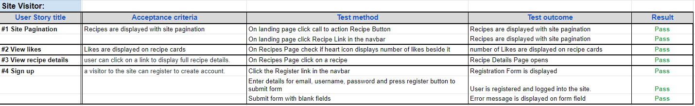

# Testing
- Testing was carried out throughout the development cycle. As each user story was completed acceptance criteria was checked.
- The deployed site was checked for appearance, responsiveness and funcionality to make sure it worked as expected for mobile, tablet, laptop and desktop devices and also for different browser types.

## Code Vaildation
- The code for Everything but the Gluten has been tested using [W3C HTML Validator](https://validator.w3.org/), [W3C CSS Validator](https://jigsaw.w3.org/css-validator/) and [Pep8 online validator](http://pep8online.com/).

### HTML Vaildation

- There were some minor fixes required after html validator testing.
- All html code writen has passed validation.
- Pages that contain Summernote render html that does not pass W3C HTML Validator checks.

### CSS Vaildation

- CSS stylesheet was tested using [W3C CSS Validator](https://jigsaw.w3.org/css-validator/) and showed no errors.

### PEP8 Vaildation

- Python files were tested using [Pep8 online validator](http://pep8online.com/) and showed no errors.

## Manual Testing

## Responsiveness Testing
- Responsivness was tested using [Google Chrome DevTools](https://developer.chrome.com/docs/devtools/) and [Responsive design checker](https://responsivedesignchecker.com/). 
    - Devices tested using these tools were Moto G4, Galaxy S5, iPhone5, iPhone6/7 iPad, iPad pro, Display < 1200px, Display > 1200px
- Physical devices used in testing were iPhone11, iPad, Laptop and extra large monitor.

## Browser Compatability
- The site was tested using Google Chrome, Microsoft Edge, Mozilla Firefox and Safari web browsers. 
- Testing checked for:
    - Rendering/Appearance
    - Responsiveness
    - Functionality 

Back to [README.md](README.md)

# Known Bugs

## Slugify recipe title
- There was an issue when submitting recipes that only one recipe could be submitted successfuly.
- This was due to the recipe title not being translated into the recipe slug field so the the first recipe being submitted had a blank slug field. The second recipe being submitted would fail because it too was being created witha blank slug field.
- The slug field must be unique.
- The solution was found on [Learn Django](https://learndjango.com/tutorials/django-slug-tutorial).
- Once the recipe title was automatically bein translated into a slug then all recipes could be submitted successfully.

## Comments not posting
- There was an issue with somem members comments not posting.
- This was found to an issue with members that didn't provide an email address when registering an account.
- the soultion was to make email a requirement on registering an account.
- [Stackoverflow](https://stackoverflow.com/questions/23956288/django-all-auth-email-required) showed how to implement this in settings.py

## Gitpod Workspace
- During development there wa an issue with my Gitpod workspace not being able to open.
- The workspace was stuck with a staus of "allocating resources" when trying to open.
- This occurred on a saturday evening and was still an issue the following day.
- A workaround was found on Slack which was to create a new workspace from my github repository and recreate the environment file.

## Mobile drop down nav menu
- There was an issue with the drop down navigation menu not working on mobile screens.
- This was found to be caused by using bootstrap js v4 instead of v5.
- Once bootstrap js matched bootstrap CSS at version 5 the mobile drop down menu worked ok.

## Unresolved

## Lighthouse

- [lighthouse](https://developers.google.com/web/tools/lighthouse) was used to test the site for performance, accessibility, best bractices and SEO.

    - Performance - How fast it takes a webpage to load.
    - Accessibility - How accessible a website is (users might need a screen reader).
    - Best Practices - How the site conforms to coding best practices.
    - SEO - Search engine optimisation. How optimised the site is for search engine results.

Back to [README.md](README.md)